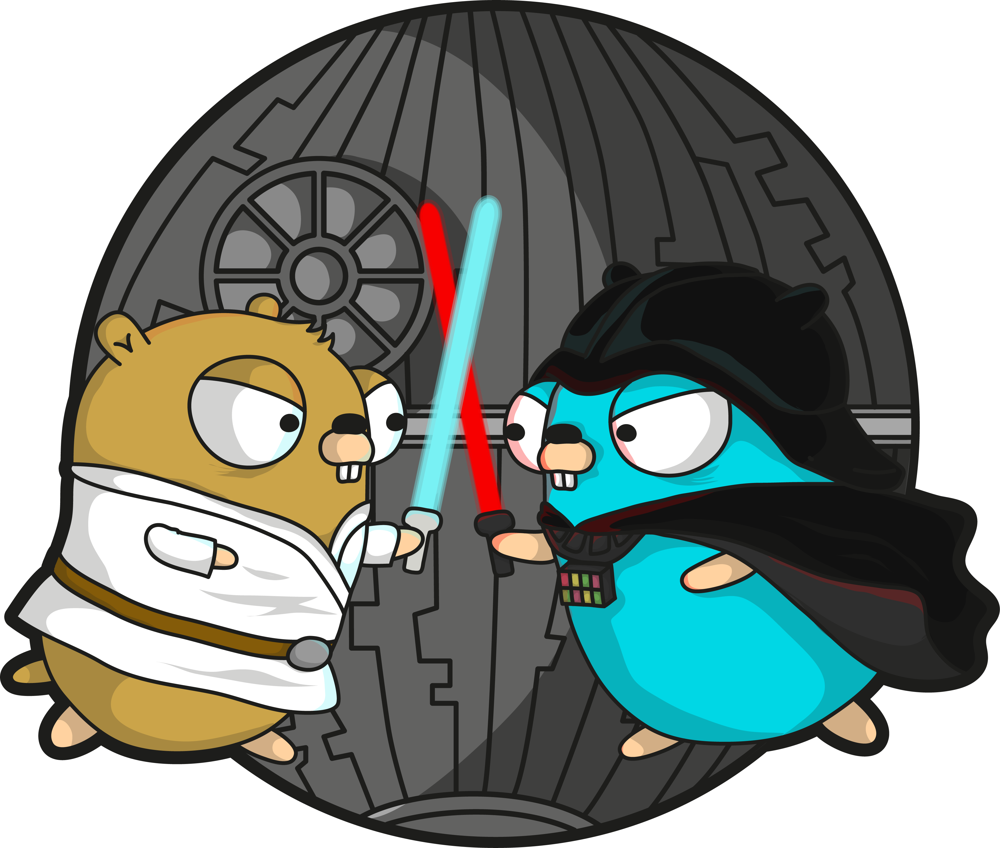

# ergoproxy 🤖    



The main idea is to develop HTTP server for proxying HTTP-requests to 3rd-party services.

Request body:

```json
{
    "method": "method",
    "url": "url",
    "headers": {
        "name": "value",
        ...
    },
    "body": "body"
}
```

Response body:

```json
{
    "id": "id",
    "status": 0,
    "headers": {
        "name": "value",
        ...
    },
    "length": 0,
    "body": "body"
}
```

## What has been implemented? 🤔

This project is implemented using grpc-gateway. The server accepts the request body, validates it, and returns the response body. The server only supports proxying for `POST`, `GET`, `PUT`, `PATCH` and `DELETE` methods, otherwise you will see a validation error.

## What about documentation? 🤔

You can find the OpenAPI specification [here](./openapiv2/api/proxy/v1/proxy.swagger.yaml) and the Protobuf3 definition [here](./proto/api/proxy/v1/proxy.proto).

## How to run it? 🤔

Just run the `make local-run` command. This command builds a Docker image with a Go binary inside and starts the container in the docker-compose.

## How to test it? 🤔

If you want to test it, you can find the Postman collection [here](./postman/).

## Thank you! 💟
